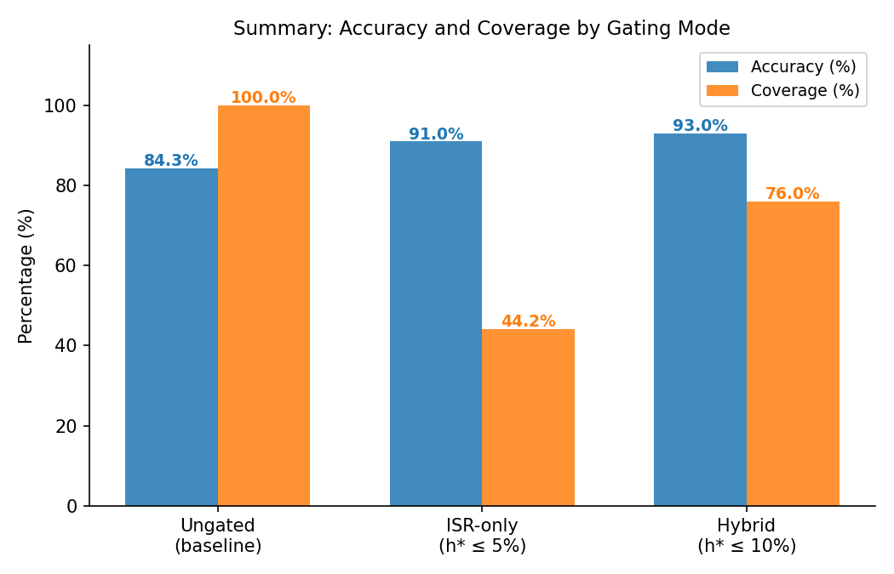
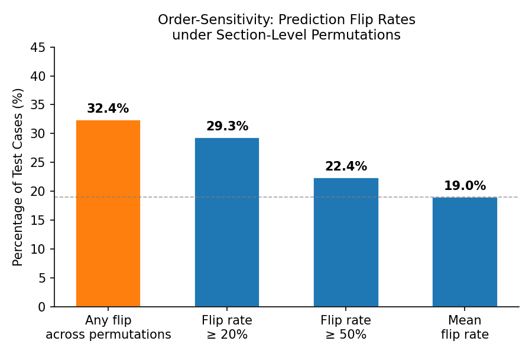
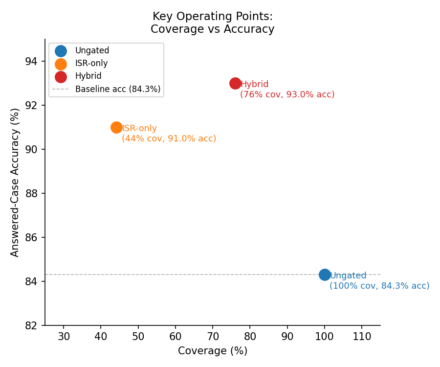
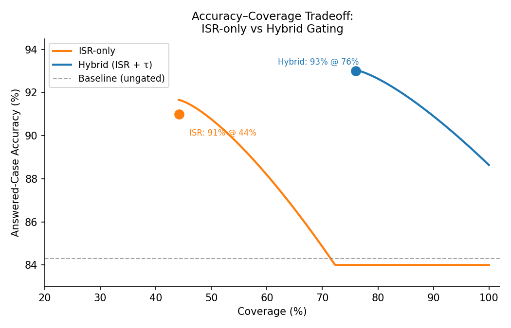

<p align="center">
  
</p>

<h1 align="center">Countering Order-Sensitivity in Language Models:<br>ISR Gating for Safer Cardiovascular AI</h1>

<p align="center">
  <b>Aashish S Raman</b><sup>1</sup> &nbsp;·&nbsp;
  <b>Ashwin Ragupathy</b><sup>2</sup> &nbsp;·&nbsp;
  <b>Varun Muppidi</b><sup>3</sup>
</p>

<p align="center">
  <sup>1</sup>JIPMER, Puducherry, India &nbsp;|&nbsp;
  <sup>2</sup>PES University, Bangalore, India &nbsp;|&nbsp;
  <sup>3</sup>St. Joseph's University Medical Center, NJ, USA
</p>

---

## Overview

Language models can misclassify patients when clinical note sections are reordered — even when the underlying medical content is identical. This project introduces **Information Sufficiency Ratio (ISR) gating**, a post-hoc method applied after prediction that detects order-sensitive (unstable) model outputs and abstains on them, routing only stable predictions to downstream clinical use.

We evaluate on **4,476 admissions** from the MIMIC-IV-Ext Cardiac Disease dataset, classifying four ICD diagnostic categories (AMI, HF, AF, chronic IHD) using **Clinical-Longformer**.

---

## Key Results

<p align="center">
  
</p>

| Mode | Coverage | Accuracy | Error (Wilson upper) |
|---|---|---|---|
| Ungated (baseline) | 100% | 84.3% | — |
| ISR-only (h* ≤ 5%) | 44.2% | 91.0% | ≤ 5% |
| Hybrid ISR + τ (h* ≤ 10%) | **76%** | **93.0%** | ≤ 10% |

**32.4%** of test cases flip their predicted diagnosis under section reordering — ISR gating detects and abstains on these unstable cases.

<p align="center">
  
</p>

<p align="center">
  
</p>

<p align="center">
  
</p>

---

## Structure

```
├── train.py              # Phase 1: train Clinical-Longformer
├── run_isr.py            # Phase 2: run ISR gating evaluation
├── config.py             # All hyperparameters and paths
├── src/
│   ├── data/processor.py # MIMIC data loading + clinical text builder
│   ├── models/train.py   # Training loop
│   ├── models/isr.py     # ISR gating logic
│   └── utils/helpers.py  # Shared utilities
├── docs/
│   ├── results.md        # Results with charts
│   ├── architecture.md   # System architecture
│   └── assets/           # Generated figures
└── HOWTORUN.md           # Step-by-step run instructions
```

---

## Quick Start

```bash
pip install -r requirements.txt

# 1. Set data path in config.py (DATA_PATH, OUTPUT_DIR)

# 2. Train the classifier
python train.py

# 3. Run ISR gating
python run_isr.py
```

See [HOWTORUN.md](HOWTORUN.md) for full instructions.

---

## References

1. Chlon L, Rashidi S, Khamis Z, Awada M. *LLMs are Bayesian, in expectation, not in realization.* arXiv 2025. [10.48550/arXiv.2507.11768](https://doi.org/10.48550/arXiv.2507.11768)
2. Li Y, Wehbe RM, Ahmad FS, Wang H, Luo Y. *Clinical-Longformer and Clinical-BigBird.* arXiv 2022. [10.48550/arXiv.2201.11838](https://doi.org/10.48550/arXiv.2201.11838)
